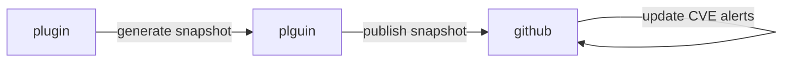
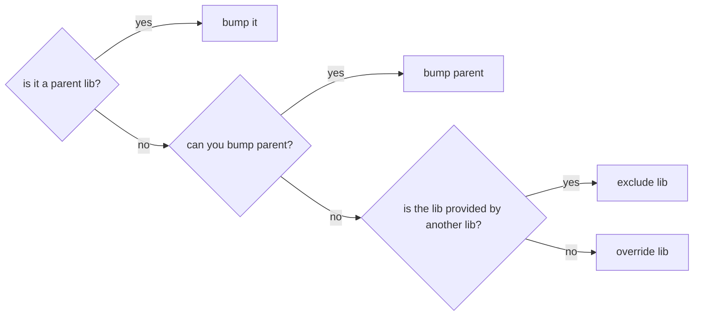

# CVEs on github

<table>

<tr>

<td>


</td>

<td>


<br/>

👋 Olivier, dev at teads

</td>

</tr>

</table>

<details>

<summary>
What we want to avoid
</summary>


[Hydrofoil ventilation video](https://www.youtube.com/watch?v=BlCuVZK2aqE)

</details>

> [!NOTE]
> The Common Vulnerabilities and Exposures (CVE) system provides a reference method 
> for publicly known information-security vulnerabilities and exposures

goal: give you tips/tools to monitor and fix CVEs

# [sbt-dependency-submition](https://github.com/scalacenter/sbt-dependency-submission/)



## Setting up the workflow

```yaml
name: Update Dependency Graph
on:
  push:
    branches:
      - main
jobs:
  dependency-graph:
    name: Update Dependency Graph
    runs-on: ubuntu-latest
    steps:
      - uses: actions/checkout@v3
      - uses: scalacenter/sbt-dependency-submission@v2
```

runs in [repo actions tab](https://github.com/yazgoo/scala-meetup-june-2024/actions) =>
alerts are in dependabot section in [repo security tab](https://github.com/yazgoo/scala-meetup-june-2024/security)

## Tools to monitor dependencies

#### dependency tree

Add to `project/plugins.sbt`:

```scala
addDependencyTreePlugin
```

run in sbt:

```scala
dependencyTree
whatDependsOn com.amazonaws aws-java-sdk-core 1.12.148
dependencyBrowseGraph
dependencyBrowseTree
evicted
```

find artifact deps:

```bash
$ coursier resolve com.amazonaws:aws-java-sdk-secretsmanager:1.12.148
```

also useful: [mvnrepository.com](https://mvnrepository.com/artifact/com.fasterxml.jackson.core/jackson-databind)

#### [sbt-dependency-check](https://github.com/albuch/sbt-dependency-check/)

```scala
addSbtPlugin("net.vonbuchholtz" % "sbt-dependency-check" % "5.1.0")
```

```bash
sbt dependencyCheck
```

- generates `target/scala-3.4.2/dependency-check-report.html`
- *WARNING⚠* does not give exactly the same results as sbt-dependency-submission

## [My fork of sbt-dependency-submition (WIP)](https://github.com/yazgoo/sbt-dependency-submission)

sbt:

```scala
githubGenerateSnapshot
githubAnalyzeDependencies alerts
githubAnalyzeDependencies cves
githubAnalyzeDependencies list jackson-databind
githubAnalyzeDependencies get jackson-databind:2.12.3
```

## Fixing CVEs

### fixing a CVE

several things you can do:



*WARNING⚠* be careful in last two cases, there might be incompatibilites

### excluding a lib

`build.sbt`:

```scala
libraryDependencies ++= Seq(
"com.test.foo" % "my-dummy-lib" % "0.1.0" exclude ("com.blah", "lib-42")
)
```

### overriding the lib

`build.sbt`:

```scala
// don't need to exclude lib version in sbt
// can update `libraryDependencies`
libraryDependencies ++= Seq("com.blah" % "lib-42" % "0.2.0"),
// or override just a jar
dependencyOverrides ++= Seq("com.blah" % "lib-42" % "0.2.0"),
```

### Conclusion

Questions ?

<details>

[Comment faire une procuration](https://www.maprocuration.gouv.fr/)

</details>
